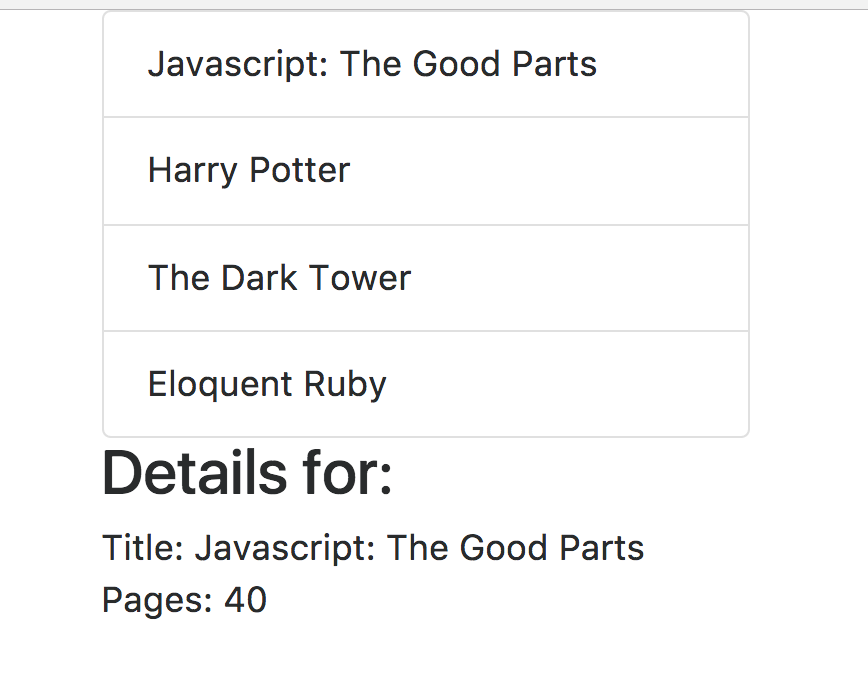

# React Books app

When you clic in a book, it display details. This project is for learning redux.

Clone or download this repository.

Install dependencies
```
npm install
```

Run webpack server
```
npm start
```

Browse over the server
```
http://localhost:8080/
```


